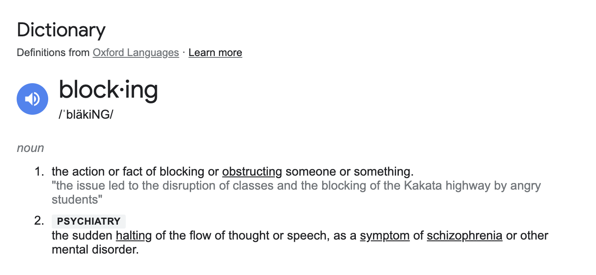

# Journal

## Start Blocking -- Monday, 17 June 2024

Started the project today and was immediately embroiled in the aggravations of running a public repository with private material in it - in this case [BBlock](https://assetstore.unity.com/packages/3d/environments/bblock-61644), the namesake of the entire project.

Went back and forth on it but eventually use [git-filter-repo](https://github.com/newren/git-filter-repo) to remove BBlock from the repository entirely. I still have a webgl build with BBlock used as part of the project, so there's that for posterity... except no there isn't because I forgot about the fucking compression stuff. So... well there's no record of it at all and we'll have to live with that. Not even a screenshot.

It was just a poorly conceived room on a plane with the rest of the BBlock assets all around.

Spoke with Rilla about the BBlock thing and the feeling of losing out by not having the complete builds available. Ended up pivoting to think I'll at least try to use [ProBuilder](https://unity.com/features/probuilder) though I'll confess plenty of trepidation: it's never been my friend.

*That* said my thought is to abandon giving a shit if it's my friend and just to make *somethings* with it... the whole point is this thing is a prototype so if it looks appalling and has light leaks well... who really gives a shit? White boxing and all that.

Should I just use unity primitives? Maybe but I feel like it'd get unweildy. Although everything is unwieldy in this like.

ANYWAY.

The idea behind the project is on this index card:

Which reads:

> __BBlock__
> - Literally make a *walking sim* with just that asset and nothing else... prototype world, prototype narrative...
> - Unity but fuck it. Can't be open on GitHub.
> - Shamelessly like Dear Esther and related
> - Acknowledge the game itself will never be made?
> - With Rilla? With David?

Pitched it to Rilla and she's in so that answers the final question. Will have to think through how the roles will work. 

"Episodic" is an important word I think. Sort of the stages of building it, maybe scene by scene so that it's all preserved as we go. The first episode should be a relatively blank place where Rilla and I are discussing what to make what I can do my limitations etc.

Although I'm now looking at *not* using BBlock at all, I still like the name *blocking*. As I pasted in to the game's home on GitHub:

>> blocking noun [U] (PREVENTING)
> 
> **the action or fact of preventing something such as light, air, or a moving object from passing through a place:**
> 
> - He is responsible for dealing with parking violations such as blocking of driveways.
> - The structure will be largely built from glass in order to minimize the blocking of bay views.
>
> **the act of preventing something from happening or succeeding:**
> 
> - The blocking of legislation was a deliberate strategy. 

>> blocking noun [U] (SPORT)
> 
> **in American football, the act of moving in front of opponents and pushing them back so that the player with the ball can carry it forwards more easily:**
> 
> - As a college player he was best known for his blocking.
> - His blocking skills help the team's running game.

>> blocking noun [U] (THEATRE)
>
> **the way that actors are arranged physically on a stage or film set:**
>
> - The long, narrow stage creates some awkward blocking—performers sometimes have to repeat things so both sides of the house can see them.
> - The actors already know their lines; they’re here to learn blocking and refine their delivery.

([Cambridge Dictionary](https://dictionary.cambridge.org/dictionary/english/blocking))

I think there are a lot of things to like in these different definitions? Maybe especially the ones from psychology and theatre?

Oh wait the psychology one isn't in Cambridge... here:

Good old [`https://www.google.com/search?q=define+blocking`](https://www.google.com/search?q=define+blocking) gives us:

That is:

> **block·ing**  
> /ˈbläkiNG/  
> *noun*  
> 1. the action or fact of blocking or obstructing someone or something.
"the issue led to the disruption of classes and the blocking of the Kakata highway by angry students"
> 2. PSYCHIATRY  
> the sudden halting of the flow of thought or speech, as a symptom of schizophrenia or other mental disorder.

So that's the starting point then.

- Co-designing/making something with Rilla
- Our conversations are part of the thing itself as audio files
- It's a prototype being a prototype complete with placeholder stuff etc.
- Uses ProBuilder to build out shapes
- Is about or involves different concepts around "blocking"

There you go kid.

(Going to try to start the practice of "dailies" where I'll put a dated and labelled screenshot in a separate folder that will sort of tell a basic visual story of the progress of the project. One picture for ever day of work)